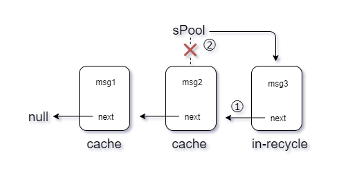
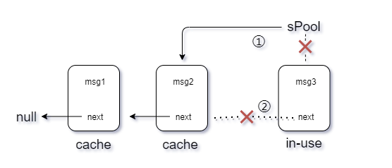

# Handler原理

## 1、`Handler` 被设计出来的原因？有什么用？

提供一种方便线程间通信的解决方案


## 2、`Handler` 的基本原理

外部通过 `Handler` 往 `MessageQueue` 里插入任务
`Looper` 在做死循环，一直从 `MessageQueue` 中获取任务
如果此时任务为空或当前没有需要执行的任务，则先判断 `IdleHandler`，`IdleHandler`为空则阻塞


## 3、主线程中创建 `Handler`，为什么不用创建`Looper`？

程序起来时在 `ActivityThread.main()` 方法以经初始化过，所以直接使用就行

`Looper.prepare()` 创建 `Looper` 并添加到 `ThreadLocal` 中
`Looper.loop()` 开始死循环从 `MessageQueue` 获取消息，每一个`Looper`中有一个`MessageQueue`，一个应用中仅且仅有一个`sMainLooper`


```java
public final class ActivityThread extends ClientTransactionHandler {
	public static void main(String[] args) {
        ...
        //创建Looper,prepareMainLooper()和prepare()差别是：
        //前者的MessageQueue不能执行quit()退出循环，后者可以
        Looper.prepareMainLooper();
        ...
        ...
        //Looper走起for循环，并从MessageQueue取msg
        Looper.loop();
    }
}

public final class Looper {
    //创建主线程Looper
    public static void prepareMainLooper() {
        //传false，不让MessageQueue退出，执行Looper.queue()会抛异常
        //IllegalStateException("Main thread not allowed to quit.")
        prepare(false);
        synchronized (Looper.class) {
            if (sMainLooper != null) {
                throw new IllegalStateException("The main Looper has already been prepared.");
            }
            sMainLooper = myLooper();
        }
    }
    
    public static void prepare() {
        //这是子线程用法，传true，可以让MessageQueue退出
        prepare(true);
    }
    
    private Looper(boolean quitAllowed) {
        // quitAllowed是用来标记MessageQueue允许退出循环
        mQueue = new MessageQueue(quitAllowed);
        mThread = Thread.currentThread();
    }
    
    //创建新的Looper,给ThreadLocal保存
    private static void prepare(boolean quitAllowed) {
        if (sThreadLocal.get() != null) {
            throw new RuntimeException("Only one Looper may be created per thread");
        }
        sThreadLocal.set(new Looper(quitAllowed));
    }

    public static @Nullable Looper myLooper() {
        return sThreadLocal.get();
    }
    
    public static void loop() {
        final Looper me = myLooper();
        if (me == null) {
            throw new RuntimeException("No Looper; Looper.prepare() wasn't called on this thread.");
        }
        final MessageQueue queue = me.mQueue;
        ...

        //死循环取
        for (;;) {
            //内部死循环，执行nativePollOnce()，没消息时处于堵塞
            Message msg = queue.next(); // might block
            if (msg == null) {
                // No message indicates that the message queue is quitting.
                return;
            }

            ...
            try {
                //用哪个Handler发消息，target就是谁，发消息的时候msg绑定了Handler
                msg.target.dispatchMessage(msg);
                dispatchEnd = needEndTime ? SystemClock.uptimeMillis() : 0;
            } finally {
                if (traceTag != 0) {
                    Trace.traceEnd(traceTag);
                }
            }
            ...

            msg.recycleUnchecked();
        }
    }
}
```


## 4、为什么建议使用 `Message.obtain()` 来创建 `Message` 实例？

对 `Message` 有效复用，可以有效的解决频繁创建 `Message` 实例问题

```java
public final class Message implements Parcelable {
	public static Message obtain() {
        synchronized (sPoolSync) {
            if (sPool != null) {
                Message m = sPool;
                sPool = m.next;
                m.next = null;
                m.flags = 0; // clear in-use flag
                sPoolSize--;
                return m;
            }
        }
        return new Message();
    }
    
    void recycleUnchecked() {
        // Mark the message as in use while it remains in the recycled object pool.
        // Clear out all other details.
        flags = FLAG_IN_USE;
        what = 0;
        arg1 = 0;
        arg2 = 0;
        obj = null;
        replyTo = null;
        sendingUid = -1;
        when = 0;
        target = null;
        callback = null;
        data = null;

        synchronized (sPoolSync) {
            if (sPoolSize < MAX_POOL_SIZE) {
                next = sPool;
                sPool = this;
                sPoolSize++;
            }
        }
    }
}
```


缓存时：

①next = sPool;//next指向上一个`Message`
②sPool = this;//`this`表示的是当前的`Message`作为消息对象池中下一个被复用的对象；



取缓存时：

① 判断头指针`sPool`是否不为空，显然这里的`sPool`已经不为空了；`Message m = sPool，`从对象池中取出一个`Message`对象赋给`m`；`sPool = m.next`，将消息对象池的下一个可复用的对象（`msg2`）赋给`sPool`（如果一开始的sPool指向msg1，那么此时sPool == null）；通俗讲就是从池中拿一个对象出来复用嘛，把它从链中断开，那么头指针要一直指着下一个可复用的对象；
②`m.next = null`，断开俩个消息之间的链接，通俗讲就是把连接2个消息的"next"剪断，让他们不再有瓜葛；




## 5、`MessageQueue` 获取消息是怎么等待

通过 `epoll` 进行等待和唤醒
在取消息`next()` 方法中，如果当前消息队列为空，则调用 `nativePollOnce`  那么`Looper`就会处于阻塞/休眠状态；

在存消息`enqueueMessage()`方法中，通过`nativeWake()`唤醒

**`nextPollTimeoutMillis` 三种情况：**

* 等于0，不阻塞立即返回

* 大于0，阻塞等待的时间

* 等于-1，无消息时会一直阻塞

`epoll` 机制是一种IO多路复用机制，具体逻辑是一个进程可以监视多个描述符，当某个描述符就绪（一般是读就绪或写就绪），能够通知程序进行相应的读写操作，这个读写操作是阻塞的，在 `Android` 中，会创建一个 `Linux`  管道来处理阻塞和唤醒

* 当消息队列为空，管道的读端等待管道中有新内容可读，就会通过 `epoll` 机制进入阻塞状态
* 当有消息要处理，就会通过管道的写端写入内容，唤醒主线程


**为什么不用 `wait` 而用 `epoll`**？

在 Android 2.2 及以前，使用的就是 wait/notify 进行等待，之后为了同时处理 `native` 侧的消息，改用了 `pipe/epoll` 机制

关于 select 、poll 、epoll，参考：https://mp.weixin.qq.com/s/YdIdoZ_yusVWza1PU7lWaw

【备注】在兼容 `native` 侧消息时，早期使用的是 `select`，后面才改成 `epoll`，参考commit：https://android.googlesource.com/platform/frameworks/base/+/46b9ac0ae2162309774a7478cd9d4e578747bfc2%5E%21/#F16

Handler.sendMessage()->sendMessageDelay()->sendMessageAtTime()->enqueueMessage()->MessageQueue.enqueueMessage()

```java
public final class MessageQueue {
    //when 指定message运行的时间参考点，message的排序依靠when
    boolean enqueueMessage(Message msg, long when) {
       ...
            msg.markInUse();
            msg.when = when;
        	//取链表头号message
            Message p = mMessages;
            boolean needWake;
        	//对比时间戳,新message的时间戳较小，则让其与链表头的message交换位置
            if (p == null || when == 0 || when < p.when) {
                // New head, wake up the event queue if blocked.
                msg.next = p;
                mMessages = msg;
                needWake = mBlocked;
            } else {
               ...
                Message prev;
                for (;;) {
                    //prev与p是相邻的两位
                    prev = p;
                    p = p.next;
                    //如果p的时间戳比新message大，那么让其插到p的前面
                    if (p == null || when < p.when) {
                        break;
                    }
                    ...
                }
                //把新message的next指向p
                msg.next = p; // invariant: p == prev.next
                //原本p的前一位的next指向新messge，完成插入程序
                prev.next = msg;
            }
        ...
            if (needWake) {
                //解除Looper堵塞/休眠状态，唤醒Looper
                nativeWake(mPtr);
            }
        }
        return true;
    }

	Message next() {
        ...
        int nextPollTimeoutMillis = 0;
        for (;;) {
            if (nextPollTimeoutMillis != 0) {
                Binder.flushPendingCommands();
            }
        	//根据nextPollTimeoutMillis的值 来做相应的阻塞
        	//0 立即唤醒线程，    > 0 延迟多久唤醒线程，   -1无限阻塞线程		
            nativePollOnce(ptr, nextPollTimeoutMillis);
            synchronized (this) {
                
                final long now = SystemClock.uptimeMillis();
                Message prevMsg = null;
                Message msg = mMessages;
                // 此消息是否是屏障消息,屏障消息特点msg.target = null
                if (msg != null && msg.target == null) {
                    do {
                        prevMsg = msg;
                        msg = msg.next;
                    //消息不为null 且 是同步消息就停止循环，意思是找出链表最靠前的一条异步消息
                    } while (msg != null && !msg.isAsynchronous());
                }
                if (msg != null) {
                    if (now < msg.when) {
                        //下一条消息的执行时间还没有到，计算堵塞时间
                        nextPollTimeoutMillis = (int) Math.min(msg.when - now, Integer.MAX_VALUE);
                    } ...
				...
            }

            /*处理IdleHandler的消息-start*/
            for (int i = 0; i < pendingIdleHandlerCount; i++) {
                final IdleHandler idler = mPendingIdleHandlers[i];
                mPendingIdleHandlers[i] = null; 

                boolean keep = false;
                try {
                    keep = idler.queueIdle();
                } catch (Throwable t) {
                    Log.wtf(TAG, "IdleHandler threw exception", t);
                }

                if (!keep) {
                    synchronized (this) {
                        mIdleHandlers.remove(idler);
                    }
                }
            }
            /*处理IdleHandler的消息-end*/
			...
        }
    }

}
```


## 6、有几类消息？

Handler的Message种类分为3种：

- 普通消息
- 屏障消息
- 异步消息

其中普通消息又称为同步消息，屏障消息又称为同步屏障。

我们通常使用的都是普通消息，除非用`setAsynchronous()`设置为异步消息，而屏障消息就是在消息队列中插入一个屏障，在屏障之后的所有普通消息都会被挡着，不能被处理。不过异步消息却例外，屏障不会挡住异步消息，因此可以这样认为：屏障消息就是为了确保异步消息的优先级，设置了屏障后，只能处理其后的异步消息，同步消息会被挡住，除非撤销屏障。


## 7、同步屏障

使用屏障消息（建立同步消息屏障）：参考：https://blog.csdn.net/cdecde111/article/details/54670136/

```java
public void realPostSyncBarrier() {
	if (methodInQueue()) {
	    postSyncBarrier(looper.getQueue());
	} else {
	    postSyncBarrier(looper);
	}
}

public void realRemoveSyncBarrier() {
	if (methodInQueue()) {
	    removeSyncBarrier(looper.getQueue());
	} else {
	    removeSyncBarrier(looper);
	}
}

//postSyncBarrier 和 removeSyncBarrier 方法是否在MessageQueue类中（api23及以上）
private static boolean methodInQueue() {
    return android.os.Build.VERSION.SDK_INT >= android.os.Build.VERSION_CODES.M;
}

private void postSyncBarrier(Object obj) {
    try{
        methodPostSyncBarrier = obj.getClass().getMethod("postSyncBarrier");
        token = (int) methodPostSyncBarrier.invoke(obj);
    } catch(Exception e) {
        e.printStackTrace();
    }
}

private void removeSyncBarrier(Object obj) {
    try{
        Method method = MessageQueue.class.getMethod("removeSyncBarrier", int.class);
        method.invoke(obj, token);
    } catch(Exception e) {
        e.printStackTrace();
    }
}
```


**`ViewRootImpl`源码中也在使用：**

UI有刷新需要时，首先会执行`ViewRootImpl`的`scheduleTraversals()`方法，接收`vsync`信号也是通过`handler`机制(且msg是异步的，在`Choreographer`类中)，所以此处设置了一个屏障，会使从当前时间点，到接收到`vsync`信号这段时间所有被插入到消息队列中的同步消息失效，直到接收到`vsync`信号后，把屏障移除。这样就保证了UI刷新信号的高优先级，保证了UI刷新的及时性

```java
ViewRootImpl.java
	void scheduleTraversals() {
        if (!mTraversalScheduled) {
            mTraversalScheduled = true;
            //建立同步屏障
            mTraversalBarrier = mHandler.getLooper().getQueue().postSyncBarrier();
            // 下一个vsync信号会回调mTraversalRunnable
            mChoreographer.postCallback(
                    Choreographer.CALLBACK_TRAVERSAL, mTraversalRunnable, null);
            if (!mUnbufferedInputDispatch) {
                scheduleConsumeBatchedInput();
            }
            notifyRendererOfFramePending();
            pokeDrawLockIfNeeded();
        }
    }

    void unscheduleTraversals() {
        if (mTraversalScheduled) {
            mTraversalScheduled = false;
            //解除同步屏障
            mHandler.getLooper().getQueue().removeSyncBarrier(mTraversalBarrier);
            mChoreographer.removeCallbacks(
                    Choreographer.CALLBACK_TRAVERSAL, mTraversalRunnable, null);
        }
    }

	// 该方法在接收到vsync信号时调用，执行view的measure、layout和draw
    void doTraversal() {
        if (mTraversalScheduled) {
            mTraversalScheduled = false;
            //解除同步屏障
            mHandler.getLooper().getQueue().removeSyncBarrier(mTraversalBarrier);

            if (mProfile) {
                Debug.startMethodTracing("ViewAncestor");
            }

            performTraversals();

            if (mProfile) {
                Debug.stopMethodTracing();
                mProfile = false;
            }
        }
    }
```


**子线程更新UI出现过一次ANR**

原因是子线程和主线程同时更新UI，连续触发了`ViewRootImpl`中的`scheduleTraversals()`，就会导致建立了多次的同步屏障，全局变量`mTraversalBarrier`已经被覆盖了，只记录了最后一个同步屏障的`token`，同步屏障不能全部移除，最终导致APP处于堵塞状态，同步信息全都执行不了，APP触发ANR。


## 8、线程和 `Handler` `Looper` `MessageQueue` 的关系

一个线程对应一个 `MessageQueue` 、一个 `Looper` 、多个 `Handler`


## 9、多个线程给 `MessageQueue` 发消息，如何保证线程安全

在 `enqueueMessage` 里进行了加锁

```java
boolean enqueueMessage(Message msg, long when) {
    ...
    //同步锁
    synchronized (this) {
    	//添加message
    }
}
```


## 10、`View.post` 和 `Handler.post` 的区别

`View.post` 时会判断有没有 `AttachInfo`，如果有则直接调用里面的 `Handler` 处理
如果没有则等待 `dispatchAttachedToWindow`，然后在通过 `Handler` 进行处理
`dispatchAttachedToWindow` 函数是在 `ViewRootImpl` 的 `performTraversals` 中调用，
这也是为什么 `View.Post` 能够获取到 `View` 的宽高的原因，因为已经执行过 `performTraversals` 了

另外View的点击事件都是通过Handler处理的

```java
public boolean onTouchEvent(MotionEvent event) {
	 switch (action) {
     	case MotionEvent.ACTION_UP:
     	...
     		if (mPerformClick == null) {
     	        mPerformClick = new PerformClick();
     	    }
            //这就是用到View.post，PerformClick实现了Runnable接口
     	    if (!post(mPerformClick)) {
     	        performClickInternal();
     	    }
     	    ...
      }
}
```

## 11、`Handler` 导致的内存泄漏

匿名内部类持有外部类，Handler有延迟消息造成无法回收，这样就造成了外部类无法回收
方法一：静态内部类 + 弱引用
方法二：将该Handler的消息全部移除

```java
方法一：
    private static class MyHandler extends Handler {	
        private final WeakReference<MainActivity> mActivityWeakReference;	
	
        private MyHandler(MainActivity activity) {	
            mActivityWeakReference = new WeakReference<MainActivity>(activity);	
        }	
	
        @Override	
        public void handleMessage(Message msg) {	
            super.handleMessage(msg);	
            if (mActivityWeakReference == null || mActivityWeakReference.get() == null) {	
                return;	
            }
            switch (msg.what) {
                case MSG_ACTION1:
                    Log.i(TAG, "MSG = " + msg.obj);
                    mActivityWeakReference.get().mainActivityMethod();
                    break;
            }
        }	
    }
    
方法二：
    @Override	
    protected void onDestroy(){	
        super.onDestroy();	
        mHandler.removeCallbacksAndMessages(null);	
    }

```


## 12、非 UI 线程真的不能操作 View 吗

大部分情况是不可以的，因为在 `ViewRootImpl` 中的 `requestLayout` 会判断线程是否为创建线程，该创建线程默认就是 `UI` 线程
其它情况如：`ViewRootImpl` 未创建修改View，子线程创建 `ViewRootImpl`，或者修改 `View` 不会触发 `requestLayout` 的场景


## 13、`Looper` 在主线程死循环，为什么不会 `ANR`

`ANR` 的原因是有任务在进行耗时操作，让本该执行的任务无法在合适的时间内执行
在于任务本身，而非死循环

补充：应用能够运行起来也是因为这个for循环在Run，当出现耗时的message时，才会出现ANR！


## 14、同步屏障和异步消息是怎么实现的

* **同步消息**：就是普通消息
* **异步消息**：通过 `setAsynchronous(true)` 设置的消息
* **同步屏障消息**：通过 `postSyncBarrier` 方法添加的消息，特点是 `target` 为空，即没有对应的 `handler`

三者关系

* 正常情况下，同步消息和异步消息都是根据 `when` 来取消息，处理消息
* 当遇到同步屏障消息时，就开始从消息队列里找异步消息，找到了再根据时间决定阻塞还是返回消息

同步屏障和异步消息存在的意义就是用于处理 “加急消息”

在 `ViewRootImpl.scheduleTraversals()` 中有具体应用


## 15、`Looper` 安全退出和非安全退出有什么区别

* 非安全退出：`removeAllMessagesLocked`，会直接清空所有未执行的消息
* 安全退出：`removeAllFutureMessagesLocked`，只清空延迟消息，非延迟消息继续处理

清空操作实际走`recycleUnchecked`方法回收


## 16、`Message` 如何实现插队

* `sendMessageAtTime(msg, 0)` ，时间传0即可
* 如果不一定要插入队头，可以通过异步消息，也能实现一定的插队效果 `msg.setAsynchronous(true)`


## 17、利用 `HanIder` 机制设计一个不崩溃的 `App`

* 第一步：设置自己的异常捕捉处理者

  ```kotlin
  Thread.setDefaultUncaughtExceptionHandler()
  ```

  此时子线程出现异常已经不会崩溃了

  但是 `UI` 线程触发异常会让 `Looper.loop` 死循环退出，接下来的消息无法处理同样会让app卡死

* 第二步：对主线程异常进行捕获

  ```kotlin
  Handler(Looper.getMainLooper()).post {
      while (true) {
          try {
              Looper.loop()
          } catch (e: Throwable) {
          }
      }
  }
  ```

  这样，`UI` 线程触发异常会被捕捉并重新 `Looper.loop()`，这样后续的消息又能继续处理，从而解决app崩溃异常

* 【注意：】经过上面两步确认解决了app崩溃的问题，但是如果在Activity的生命周期内触发异常，如 `onCreate` 中，则会出现黑屏白屏的情况，原因是生命周期内抛出异常，会导致界面无法完成， `Activity` 无法正确启动，就会出现黑屏白屏的情况。由于 `Activity` 的生命周期都是通过主线程的 `Handler` 进行处理的，可以通过反射 `ActivityThread` 中的 `Handler` 进行 `Activity` 生命周期异常捕获，然后进行 `finishActivity` 或者杀死进程的操作

* 【说明】第二步中可以理解为外部 `loop` 一直在等待 `post` 里的 `loop` 结束

* 【参考一：】https://juejin.cn/post/6904283635856179214

* 【参考二：】https://github.com/android-notes/Cockroach/blob/master/%E5%8E%9F%E7%90%86%E5%88%86%E6%9E%90.md

* 【相关库：】https://github.com/android-notes/Cockroach


