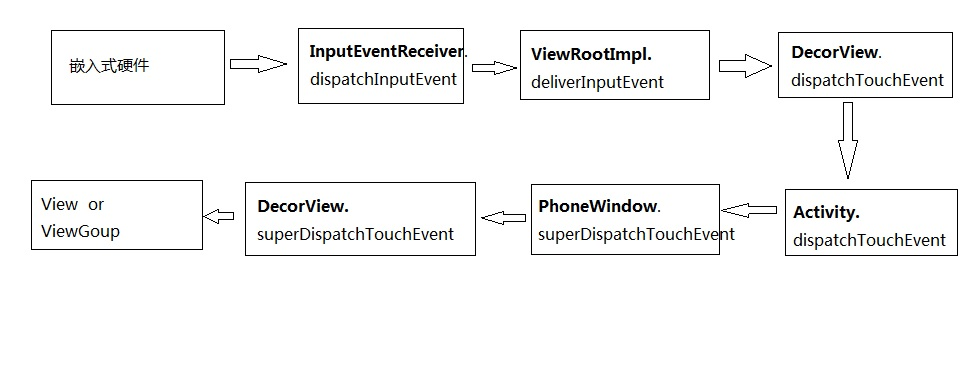
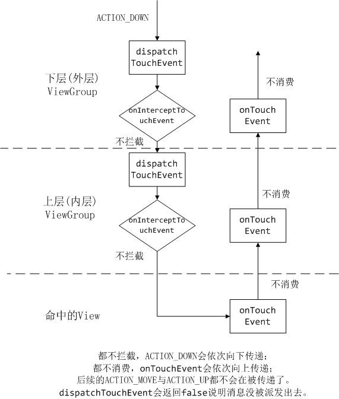
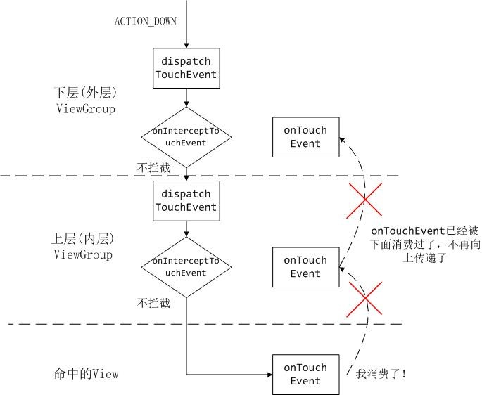
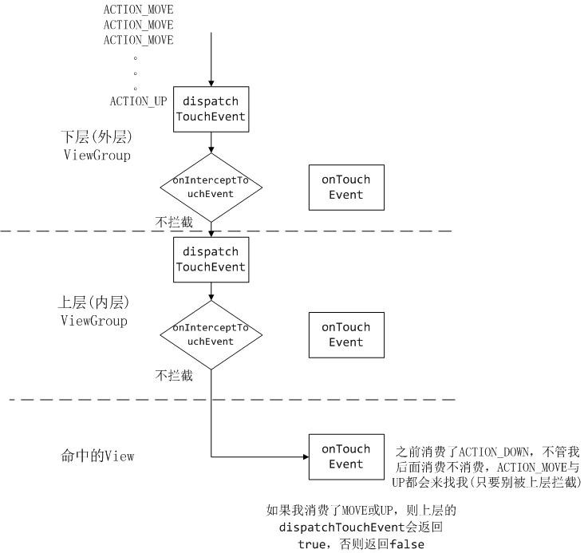
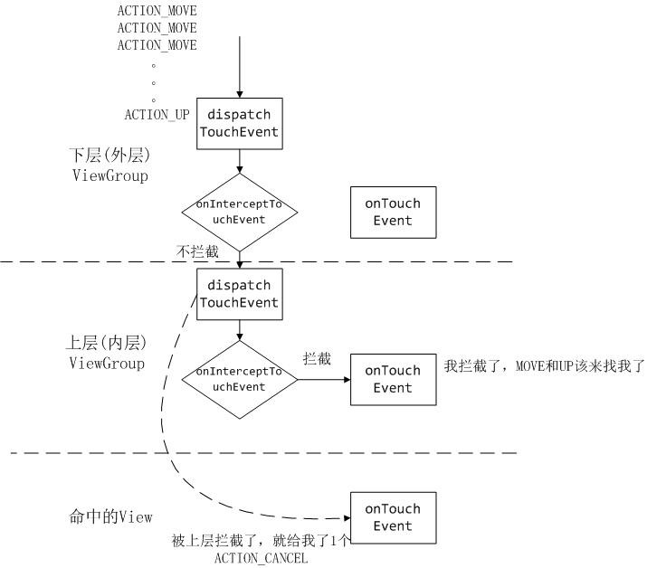
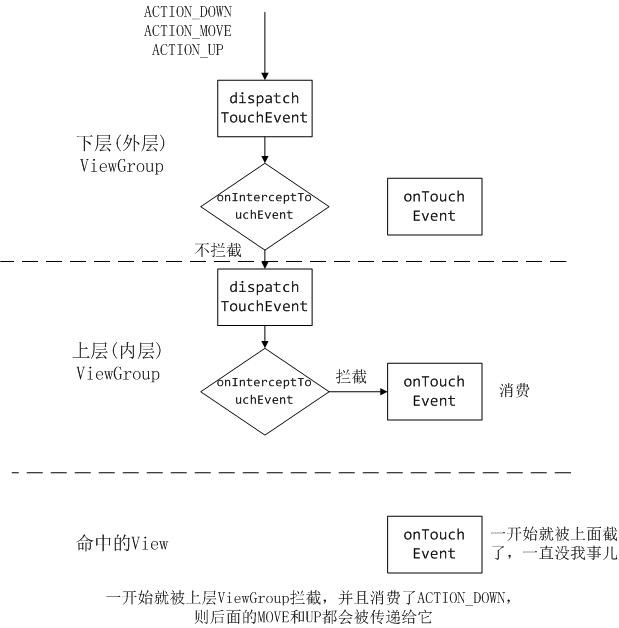

# view的触摸事件

## 一、触摸事件从屏幕传到View/ViewGroup：



## 二、ViewGroup分发给子View，都不消费的情况：




## 三、子View消费







## 四、父控件消费







## 五、方法参数说明

View里，有两个回调函数 ：

public boolean dispatchTouchEvent(MotionEvent ev)；  

public boolean onTouchEvent(MotionEvent ev);  

 

ViewGroup里，有三个回调函数 ：

public boolean dispatchTouchEvent(MotionEvent ev)；  

public boolean onInterceptTouchEvent(MotionEvent ev);  

public boolean onTouchEvent(MotionEvent ev); 

 

在Activity里，有两个回调函数 ：

public boolean dispatchTouchEvent(MotionEvent ev)；  

public boolean onTouchEvent(MotionEvent ev);  


单手指操作：ACTION_DOWN---ACTION_MOVE---ACTION_UP---ACTION_CANCEL

多手指操作：ACTION_DOWN---ACTION_POINTER_DOWN---ACTION_MOVE--ACTION_POINTER_UP---ACTION_UP.


View的onTouchEvent

```kotlin
override fun onTouchEvent(event: MotionEvent?): Boolean {
    //以下这两句代码同等效果，都是消费了一组的点击事件
    //return event.actionMasked == MotionEvent.ACTION_DOWN
    //return true
    
    
    //单点触控
    //第一根手指点击
    MotionEvent.ACTION_DOWN
    //第一根手指抬起
    MotionEvent.ACTION_UP
    MotionEvent.ACTION_MOVE
    MotionEvent.ACTION_CANCEL
    //多点触控
    //非第一根手指按下（意思是按下之前已经有手指在屏幕上）
    MotionEvent.ACTION_POINTER_DOWN
    //非最后一根手指抬起（意思是抬起之后依然还有手指在屏幕上）
    MotionEvent.ACTION_POINTER_UP
    
    
    return true
}

//扩展
event.action:不支持多点触控
event.actionMasked：支持多点触控，用这个最为安全，例如用两个手指缩放图片

mTouchDelegate是触摸代理，为了扩大view的点击区域

//布局文件中配置的，长按view就会弹出与小窗，显示位置与触摸位置接近（安卓8.0及以上支持）
android:tooltipText="描述内容"


//这是ViewGroup
class TouchLayout(context: Context?, attrs: AttributeSet?) : ViewGroup(context, attrs) {
    override fun onLayout(changed: Boolean, l: Int, t: Int, r: Int, b: Int) {

    }

    /**
     * return false 会让控件不去判断你是否要滑动而做出延时判断，
     * 能非常直接快速的下发事件给子view，具体等待的时间可以
     * 在View.java源码中可找到定义的常量：TAP_TIMEOUT = 100
     * */
    override fun shouldDelayChildPressedState(): Boolean {
        return false
    }
} 
```

