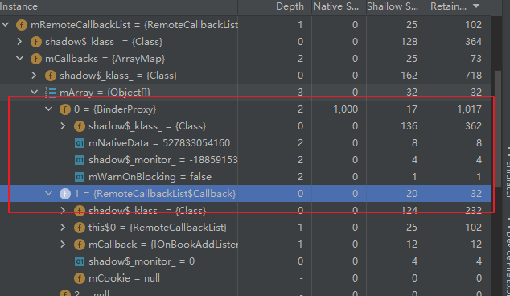
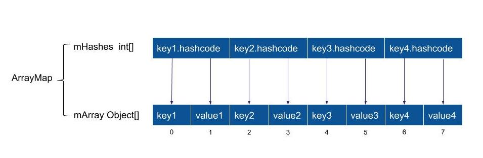
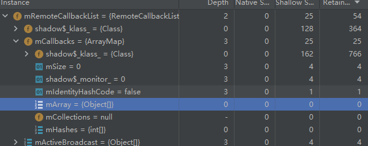
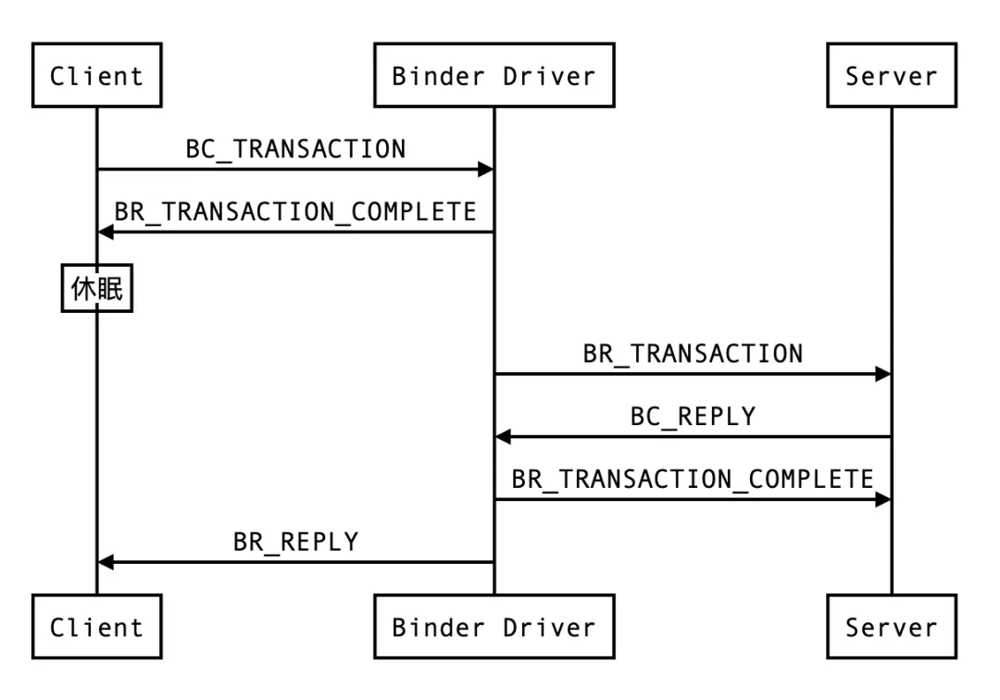
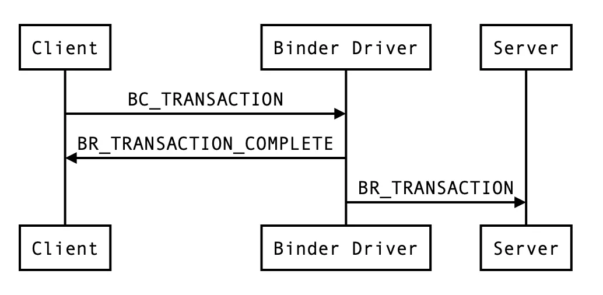

# AIDL
> 注：
> 一、如果不需要跨进程，则应继承`Binder`并返回给绑定服务调用处；参考：https://developer.android.com/guide/components/bound-services#Binder
> 二、如果需要跨进程但不需要处理多线程，则建议使用`Messenger`来实现接口；参考：https://developer.android.com/guide/components/bound-services#Messenger

## 一、传输类型in、out、inout

> 注：最好把所有的aidl文件放在同一个包中,因为另一个进程调用时需要一样的包名才能生效

新建一个以aidl为后缀的文件,其它类型参数必须标上方向:`in` `out` 或者`inout`。
in表示输入型参数，即数据只能从客户端传递向服务端，由服务端传递向客户端的参数会变成默认值
out表示输出型参数，即数据只能从服务端传递向客户端，由客户端传递向服务的参数会变成默认值
inout表示输入输出型，可以双向传递数据；

### **使用in、out、inout的区别**

IBookManager.aidl

```java
package com.test.aidl;
import com.test.aidl.Book;

interface IBookManager {
    Book getBookList();
    // oneway 声明单向调用，client端的异步调用，server端的串行化处理，
    //oneway声明book只能用单向的in，不能out或inout
    oneway void setBook(in Book book); 
    
    void addListener(in IBookListener listener);
    void removeListener(in IBookListener listener);
}

package com.test.aidl;
import com.test.aidl.Book;

interface IBookListener {
    void handlerBook(out Book book);
}

//使用in、out、inout的区别
@Override public void setBook(com.test.aidl.Book.Book book) throws android.os.RemoteException
      {
        android.os.Parcel _data = android.os.Parcel.obtain();
        android.os.Parcel _reply = android.os.Parcel.obtain();
        try {
          _data.writeInterfaceToken(DESCRIPTOR);
          /*in、inout声明的数据有这块逻辑*/
          if ((book!=null)) {
            _data.writeInt(1);
            book.writeToParcel(_data, 0);
          }
          else {
            _data.writeInt(0);
          }
          /*in、inout声明的数据有这块逻辑*/
          boolean _status = mRemote.transact(Stub.TRANSACTION_transfer, _data, _reply, 0);
          if (!_status && getDefaultImpl() != null) {
            getDefaultImpl().transfer(book);
            return;
          }
          _reply.readException();
          /*out声明的数据有这块逻辑*/
          if ((0!=_reply.readInt())) {
            book.readFromParcel(_reply);
          }
          /*out声明的数据有这块逻辑*/
        }
        finally {
          _reply.recycle();
          _data.recycle();
        }
      }


```

## 二、序列化对象

由于用到了自定义的Parcelable对象,必须新建一个和它同名的AIDL文件,并在其中声明它为Parcelable类型
例:上面我们用到了Book这个类,所以要创建
Book.aidl

```java
package com.test.aidl;
parcelable Book;
```

跨进程数据传递需要赋值封装,这样才能跨进程传递数据

**参数顺序必须一致，不然会乱码**

Book.java

```java
public class Book implements Parcelable{
    public int mId;
    public String mName;
    
    public Book(){
    }
    
    /****************这三个方法内的参数顺序必须一致，不然会乱码****************/
    public Book(Parcel in) {
        mId = in.readInt();//这里顺序是mId、mName，下面两个方法必须也是一样的顺序
        mName = in.readString();
    }
    
    public void readFromParcel(Parcel in) {
        this.mId = in.readInt();
        this.mName = in.readString();
    }

    @Override
    public void writeToParcel(Parcel dest, int flags) {
        dest.writeInt(mId);
        dest.writeString(mName);
    }
    /****************这三个方法内的参数顺序必须一致，不然会乱码****************/
    
    @Override
    public int describeContents() {
        return 0;
    }
    
    public static final Parcelable.Creator<Book> CREATOR = new Parcelable
        .Creator<Book>() {
        public Book createFromParcel(Parcel in) {
            return new Book(in);
        }

        public Book[] newArray(int size) {
            return new Book[size];
        }
    };
}
```


## 三、远程服务端Service的实现

```java
package com.test.service;
public class BookManagerService extends Service {
    //管理客户端传过来的listener，当客户端进程死掉之后，及时释放内存，防止内存泄漏
    private final RemoteCallbackList<IBookListener> mRemoteCallbackList = new RemoteCallbackList<>();
    
    private Book mBook = new Book();
    
    private Binder mBinder = new IBookManager.Stub(){
        @Override
        public Book getBookList() throws RemoteException{
            return mBook;
        }
        @Override
        public void setBook(Book book) throws RemoteException {
            mBook = book;
        }
		@Override
        public void addListener(IBookListener listener) throws RemoteException {
            Log.e(TAG, "Remote addListener......");
            //使用RemoteCallbackList，内部对进程死亡监听，及时释放内存，防止内存泄漏
            mRemoteCallbackList.register(listener);
        }
        @Override
        public void removeListener(IBookListener listener) throws RemoteException {
            Log.e(TAG, "Remote removeListener......");
            mRemoteCallbackList.unregister(listener);
        }
        
    }
    
    /*回调给Client*/
    public void doCallBack() {
        try {
            //获取存活进程的listener size
            int size = mRemoteCallbackList.beginBroadcast();
            for (int i = 0; i < size; i++) {
                IBookListener listener = mRemoteCallbackList.getBroadcastItem(i);
                listener.handlerBook(new Book(9527, "bookName");
            }
            mRemoteCallbackList.finishBroadcast();
        } catch (RemoteException exception) {
            Log.e(TAG, "Remote timer error: " + Log.getStackTraceString(exception));
        }
    }

    @Override
    public void onCreate(){
        super.onCreate();
    }

    @Override
    public IBinder onBind(Intent intent) {
        return mBinder;
    }
}
```


## 四、客户端的实现

```java
public class BookManagerActivity extends Activity{

    IBookManager mBookManager
    
    private ServiceConnection mConnection = new ServiceConnection(){
        public void onServiceConnected(ComponentName className, IBinder service) {
            mBookManager = IBookManager.Stub.asInterface(service);
            try {
                mBookManager.asBinder().linkToDeath(mDeathRecipient, 0);// 死亡监听
            } catch (RemoteException e) {
                e.printStackTrace();
            }
            
            bookManager.getBookList();//做你要做的操作
            bookManager.addListener(new BookListener());//加入回调，数据将会从服务端回传
        }
        
        public void onServiceDisconnected(ComponentName className) {
        
        }
    }
    
    public class BookListener extends IBookListener.Stub {
        private static final String TAG = "AIDL_Test_" + BookListener.class.getSimpleName();

        @Override
        public void handlerBook(Book book) throws RemoteException {
            Log.e(TAG, "Client handlerBook: " + book);
        }
    }
    
    private IBinder.DeathRecipient mDeathRecipient = new IBinder.DeathRecipient() {
        @Override
        public void binderDied() {
            if (mBookManager == null) {
                return;
            }
            mBookManager.asBinder().unlinkToDeath(mDeathRecipient, 0);
            mBookManager = null;
            
            // 这里可以做重新启动服务的操作
        }
    };

    @Override
    public void onCreate(Bundle savedInstanceState) {
        Intent intent = new Intent(this,BookManagerService.class);
        bindService(intent,mConnection,Context.BIND_AUTO_CREATE);
    }

    @Override
    public void onDestroy(){
        super.onDestroy();
        unbindService(mConnection);
    }
}
```

需要注意的地方

1. 要往子进程传递一个监听类如：`IOnNewBookArrivedListener `，那么该类必须是Binder的子类；由于跨进程通讯该监听类会序列化传递到子进程再反序列化重新生成一个对象，所以用普通的List去存储监听类是无法移除的；这里要使用`RemoteCallbackList`的`register`方法和`unregister`来存取；
   * 由于跨进程传输对象的底层Binder对象是同一个，`RemoteCallbackList`便是使用这一点来进行添加移除
   * `RemoteCallbackList`的遍历需要通过`beginBroadcast`和`finishBroadcast`配对使用
   * 内部是获取  `Bind`  并通过 `linkToDeath` 实现状态监听的


RemoteCallbackList 添加listener的情况



存放listener用到`ArrayMap`，内部用mArray存放key跟value，所以存放一个listener时会看到第0、1上都有元素；

还有一个存放Key的hash值的数组mHashes，数组长度只有mArray的一半；详细参考：http://gityuan.com/2019/01/13/arraymap/




RemoteCallbackList 清空listener的情况




### 跨进程内存泄漏

在跨进程调用IPC方法，即当前进程传递回调监听`Listener`到目标进程，在取消监听后该`Listener`不会立马被回收，会存入一个静态链表`ReferenceQueue`中，有一个专门的守护线程去维护这个链表，当该线程执行的时候会弹出里面的对象，执行他们的`finalize`方法，下次执行GC时才会被回收。

内存泄漏：
直接原因时该守护线程优先级比较低，运行的时间比较少。当`ReferenceQueue`持有的对象过多时，守护线程来不及弹出对象，造成无论如何GC都不会回收。
如果监听类持有`Context`等需要回收的对象，会造成内存泄漏

其中Android9.0之前对象会被`FinalizerFeference`持有并存入`ReferenceQueue`：


Android9.0起（含9.0）对象会被`Cleaner`持有并存入`ReferenceQueue`：


### 关于 oneway

```java
interface IPlayer {
    oneway void start();//异步，假设执行2秒
    oneway void stop();//异步，假设执行2秒
    int getVolume();// 同步，假设执行1秒
}
```

主要有两个特征：

* 异步调用：异步调用时指 client 向 binder 驱动发送数据后不用挂起线程等待 binder 驱动回复，直接结束，比如 AMS 调用应用进程启动 Activity，这样那么应用程序做了耗时操作也不会阻塞系统服务
* 串行化处理：指对于一个服务端的 AIDL 接口而言，所有的 oneway 方法不会同时执行，binder 驱动会将他们串行化处理，排队一个个调用

binder 协议：

非 oneway 情况



oneway 情况：



由外部发送给 binder 驱动的都是 BC 开头，binder 驱动往外发的都是 BR 开头

#### oneway的实现原理：

- Binder底层会**创建线程**异步处理任务，保证多个进程调用多个oneway方法并行调用
- 当多个进程 调用 **同一个进程**的oneway方法时，则需要排队，内部通过判断是否访问同一个`binder_node`（Binder进程），如果是就把
  这次 Binder_work 放到 binder_node 的 async_todo 队列中，不会立刻执行


**问：怎么理解客户端线程挂起等待呢？有没有实际占用 CPU 的调度？**

答：等待 binder 驱动返回数据相对于线程的 sleep 操作，底层调用的是 wait_event_interruptible() linux 系统函数，所以不会占用 CPU

