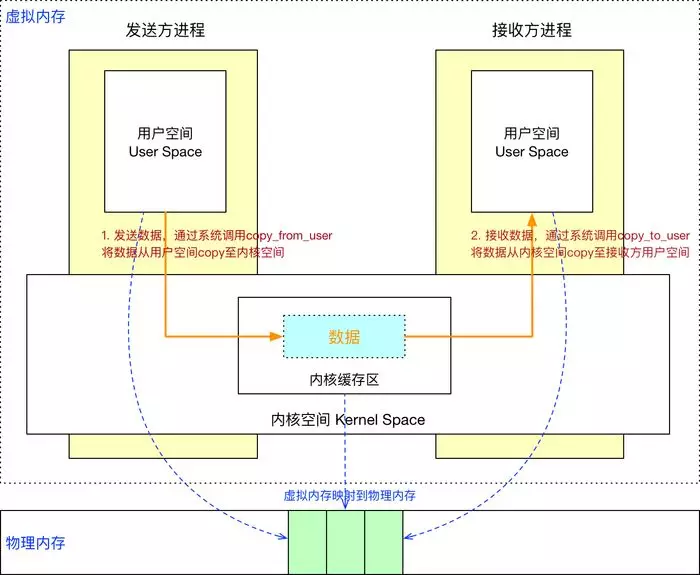
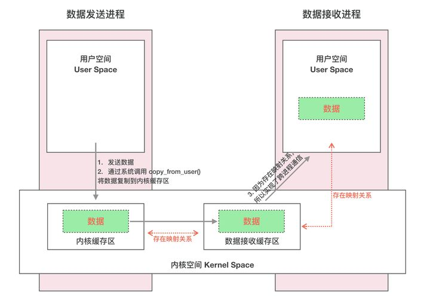
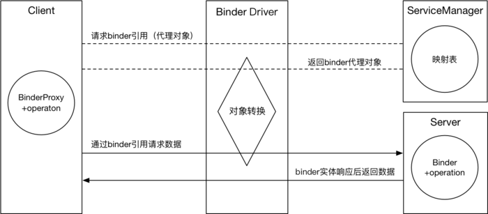

# IPC&Binder

https://mp.weixin.qq.com/s/EE8H7Q3Dysas5kLs-jN-vg

## Linux IPC

### 一、传统的进程间通信（数据拷贝）

IPC通信模型：




**用户空间：**虚拟内存空间，32位的操作系统寻址长度=2^32 约4G

**实现方式：**`copy_from_user()`->内核缓存->`copy_to_user()`实现进程间通信

这种传统的 IPC 通信方式有两个问题：

1. 性能低下，一次数据传递需要经历：内存缓存区 --> 内核缓存区 --> 内存缓存区，需要 2 次数据拷贝；
2. 接收数据的缓存区由数据接收进程提供，但是接收进程并不知道需要多大的空间来存放将要传递过来的数据，因此只能开辟尽可能大的内存空间或者先调用 API 接收消息头来获取消息体的大小，这两种做法不是浪费空间就是浪费时间。


### 二、Linux虚拟内存和物理内存的理解

**第一层理解**

**1.     每个进程都有自己独立的4G内存空间，各个进程的内存空间具有类似的结构**

 

**2.    一个新进程建立的时候，将会建立起自己的内存空间，此进程的数据，代码等从磁盘拷贝到自己的进程空间，哪些数据在哪里，都由进程控制表中的task_struct记录，task_struct中记录中一条链表，记录中内存空间的分配情况，哪些地址有数据，哪些地址无数据，哪些可读，哪些可写，都可以通过这个链表记录**

 

**3.    每个进程已经分配的内存空间，都与对应的磁盘空间映射**


**问题：**

**计算机明明没有那么多内存（n个进程的话就需要n\*4G）内存**

建立一个进程，就要把磁盘上的程序文件拷贝到进程对应的内存中去，对于一个程序对应的多个进程这种情况，浪费内存！

**第二层理解
**

1.     每个进程的4G内存空间只是虚拟内存空间，每次访问内存空间的某个地址，都需要把地址翻译为实际物理内存地址

2.     所有进程共享同一物理内存，每个进程只把自己目前需要的虚拟内存空间映射并存储到物理内存上。

3.     进程要知道哪些内存地址上的数据在物理内存上，哪些不在，还有在物理内存上的哪里，需要用页表来记录

4.     页表的每一个表项分两部分，第一部分记录此页是否在物理内存上，第二部分记录物理内存页的地址（如果在的话）

5. 当进程访问某个虚拟地址，去看页表，如果发现对应的数据不在物理内存中，则缺页异常

6. 缺页异常的处理过程，就是把进程需要的数据从磁盘上拷贝到物理内存中，如果内存已经满了，没有空地方了，那就找一个页覆盖，当然如果被覆盖的页曾经被修改过，需要将此页写回磁盘

**总结：**

**优点：**

**1.既然每个进程的内存空间都是一致而且固定的，所以链接器在链接可执行文件时，可以设定内存地址，而不用去管这些数据最终实际的内存地址，这是有独立内存空间的好处**

**2.当不同的进程使用同样的代码时，比如库文件中的代码，物理内存中可以只存储一份这样的代码，不同的进程只需要把自己的虚拟内存映射过去就可以了，节省内存**

**3.在程序需要分配连续的内存空间的时候，只需要在虚拟内存空间分配连续空间，而不需要实际物理内存的连续空间，可以利用碎片。**


**补充理解：**

**虚拟存储器涉及三个概念： 虚拟存储空间，磁盘空间，内存空间**

**可以认为虚拟空间都被映射到了磁盘空间中，（事实上也是按需要映射到磁盘空间上，通过mmap），并且由页表记录映射位置，当访问到某个地址的时候，通过页表中的有效位，可以得知此数据是否在内存中，如果不是，则通过缺页异常，将磁盘对应的数据拷贝到内存中，如果没有空闲内存，则选择牺牲页面，替换其他页面。**

 

**mmap是用来建立从虚拟空间到磁盘空间的映射的，可以将一个虚拟空间地址映射到一个磁盘文件上，当不设置这个地址时，则由系统自动设置，函数返回对应的内存地址（虚拟地址），当访问这个地址的时候，就需要把磁盘上的内容拷贝到内存了，然后就可以读或者写，最后通过manmap可以将内存上的数据换回到磁盘，也就是解除虚拟空间和内存空间的映射，这也是一种读写磁盘文件的方法，也是一种进程共享数据的方法 共享内存**


## Android Binder

### **一、Android进程间通信（数据拷贝+内存映射）**

#### Binder通信模型：




#### Binder的代理机制：




流程：

1. Server向ServiceManager注册

   Server通过Binder驱动向ServiceManager注册，声明可以对外提供服务。ServiceManager中会保留一份映射表：包名为zhangsan的Server对应的Binder引用是0x12345。

2. Client向ServiceManager请求Server的Binder引用

   Client想要请求Server的数据时，需要先通过Binder驱动向ServiceManager请求Server的Binder引用：我要向包名为zhangsan的Server通信，请告诉我Server的Binder引用。

3. 向具体的Server发送请求

   Client拿到这个Binder引用后，就可以通过Binder驱动和Server进行通信了。

4. Server返回结果

   Server响应请求后，需要再次通过Binder驱动将结果返回给Client。


Binder机制是如何创造第一只下蛋的鸡呢？

1. 当Android系统启动后，会创建一个名称为`servicemanager`的进程，这个进程通过一个约定的命令`BINDER_SET_CONTEXT_MGR`向Binder驱动注册，申请成为为`ServiceManager`，Binder驱动会自动为`ServiceManager`创建一个Binder实体（第一只下蛋的鸡）；
2. 并且这个Binder实体的引用在所有的Client中都为0，也就说各个Client通过这个0号引用就可以和`ServiceManager`进行通信。Server通过0号引用向`ServiceManager`进行注册，Client通过0号引用就可以获取到要通信的Server的Binder引用。

Android Binder设计与实现 - 设计篇 *https://blog.csdn.net/universus/article/details/6211589* 中对Client、Server、Binder驱动和ServiceManager有更详细的介绍。


#### binder和socket哪个安全？

##### 1. **Binder**

- **安全性特点**：
  - **权限控制**：Binder支持细粒度的权限控制，可以通过Android的权限机制（如`<permission>`标签）限制哪些应用或组件可以访问特定的Binder服务。
  - **身份验证**：Binder通信时，调用方的**UID**会被传递给服务端，服务端可以验证调用方的身份。
    - 每个应用程序在安装时会被分配一个唯一的 UID，并记录在 `/data/system/packages.xml` 文件中。
  - **数据封装**：Binder使用Parcel对象来封装数据，支持序列化和反序列化，数据在传输过程中不易被篡改。
  - **系统级保护**：Binder是Android系统的一部分，运行在内核空间，受到Android安全机制的保护。
- **适用场景**：适用于Android系统内部的高安全性通信，如系统服务与应用之间的通信。

------

##### 2. **Socket**

- **定义**：Socket是一种通用的网络通信机制，支持跨设备、跨网络的进程间通信。
- **安全性特点**：
  - **灵活性高**：Socket可以用于本地通信（如Unix Domain Socket）或网络通信（如TCP/IP Socket）。
  - **安全性依赖实现**：Socket本身不提供内置的安全机制，安全性依赖于具体的实现方式。
    - 如果使用明文传输，数据容易被窃听或篡改。
    - 可以通过SSL/TLS等加密协议增强安全性，但这需要额外配置。
  - **权限控制较弱**：Socket的权限控制通常依赖于操作系统的文件权限或网络防火墙规则，不如Binder的权限控制精细。
- **适用场景**：适用于跨设备或跨网络的通信，安全性需要开发者自行实现。

------

##### 3. **安全性对比**

| 特性           | Binder                      | Socket                     |
| :------------- | :-------------------------- | :------------------------- |
| **权限控制**   | 细粒度，基于Android权限机制 | 依赖操作系统权限，较粗粒度 |
| **身份验证**   | 内置UID验证                 | 需要自行实现               |
| **数据保护**   | 封装在Parcel中，不易篡改    | 需要额外加密（如SSL/TLS）  |
| **适用场景**   | Android系统内部通信         | 跨设备、跨网络通信         |
| **安全性依赖** | 系统级保护，安全性较高      | 依赖开发者实现，安全性较低 |

------

##### 4. **总结**

- **Binder**在Android系统内部通信中更安全，因为它内置了权限控制和身份验证机制，适合高安全性要求的场景。
- **Socket**的灵活性更高，但安全性需要开发者额外实现（如加密、身份验证等），适合跨设备或跨网络的通信。

如果是在Android系统内部通信，优先选择Binder；如果需要跨网络通信，则选择Socket，并确保实现足够的安全措施。


### 二、AIDL代码解析

IBookManager.java

```java
/*
 * This file is auto-generated.  DO NOT MODIFY.
 */
package com.hpf.aidldemo.aidlinterface;
public interface IBookManager extends android.os.IInterface
{
  /** Default implementation for IBookManager. */
  public static class Default implements com.hpf.aidldemo.aidlinterface.IBookManager
  {
    @Override public void addBook(com.hpf.aidldemo.Book book) throws android.os.RemoteException
    {
    }
    @Override public void registerListener(com.hpf.aidldemo.aidlinterface.IOnBookAddListener listener) throws android.os.RemoteException
    {
    }
    @Override
    public android.os.IBinder asBinder() {
      return null;
    }
  }
  /** Local-side IPC implementation stub class. */
  public static abstract class Stub extends android.os.Binder implements com.hpf.aidldemo.aidlinterface.IBookManager
  {
    private static final java.lang.String DESCRIPTOR = "com.hpf.aidldemo.aidlinterface.IBookManager";
    /** Construct the stub at attach it to the interface. */
    public Stub()
    {
      this.attachInterface(this, DESCRIPTOR);
    }
    /**
     * Cast an IBinder object into an com.hpf.aidldemo.aidlinterface.IBookManager interface,
     * generating a proxy if needed.
     */
    public static com.hpf.aidldemo.aidlinterface.IBookManager asInterface(android.os.IBinder obj)
    {
      if ((obj==null)) {
        return null;
      }
      android.os.IInterface iin = obj.queryLocalInterface(DESCRIPTOR);
      if (((iin!=null)&&(iin instanceof com.hpf.aidldemo.aidlinterface.IBookManager))) {
        return ((com.hpf.aidldemo.aidlinterface.IBookManager)iin);
      }
      return new com.hpf.aidldemo.aidlinterface.IBookManager.Stub.Proxy(obj);
    }
    @Override public android.os.IBinder asBinder()
    {
      return this;
    }
    @Override public boolean onTransact(int code, android.os.Parcel data, android.os.Parcel reply, int flags) throws android.os.RemoteException
    {
      java.lang.String descriptor = DESCRIPTOR;
      switch (code)
      {
        case INTERFACE_TRANSACTION:
        {
          reply.writeString(descriptor);
          return true;
        }
        case TRANSACTION_addBook:
        {
          data.enforceInterface(descriptor);
          com.hpf.aidldemo.Book _arg0;
          if ((0!=data.readInt())) {
            _arg0 = com.hpf.aidldemo.Book.CREATOR.createFromParcel(data);
          }
          else {
            _arg0 = null;
          }
          this.addBook(_arg0);
          reply.writeNoException();
          return true;
        }
        case TRANSACTION_registerListener:
        {
          data.enforceInterface(descriptor);
          com.hpf.aidldemo.aidlinterface.IOnBookAddListener _arg0;
          _arg0 = com.hpf.aidldemo.aidlinterface.IOnBookAddListener.Stub.asInterface(data.readStrongBinder());
          this.registerListener(_arg0);
          reply.writeNoException();
          return true;
        }
        default:
        {
          return super.onTransact(code, data, reply, flags);
        }
      }
    }
    private static class Proxy implements com.hpf.aidldemo.aidlinterface.IBookManager
    {
      private android.os.IBinder mRemote;
      Proxy(android.os.IBinder remote)
      {
        mRemote = remote;
      }
      @Override public android.os.IBinder asBinder()
      {
        return mRemote;
      }
      public java.lang.String getInterfaceDescriptor()
      {
        return DESCRIPTOR;
      }
      @Override public void addBook(com.hpf.aidldemo.Book book) throws android.os.RemoteException
      {
        android.os.Parcel _data = android.os.Parcel.obtain();
        android.os.Parcel _reply = android.os.Parcel.obtain();
        try {
          _data.writeInterfaceToken(DESCRIPTOR);
          if ((book!=null)) {
            _data.writeInt(1);
            book.writeToParcel(_data, 0);
          }
          else {
            _data.writeInt(0);
          }
          boolean _status = mRemote.transact(Stub.TRANSACTION_addBook, _data, _reply, 0);
          if (!_status && getDefaultImpl() != null) {
            getDefaultImpl().addBook(book);
            return;
          }
          _reply.readException();
        }
        finally {
          _reply.recycle();
          _data.recycle();
        }
      }
      @Override public void registerListener(com.hpf.aidldemo.aidlinterface.IOnBookAddListener listener) throws android.os.RemoteException
      {
        android.os.Parcel _data = android.os.Parcel.obtain();
        android.os.Parcel _reply = android.os.Parcel.obtain();
        try {
          _data.writeInterfaceToken(DESCRIPTOR);
          _data.writeStrongBinder((((listener!=null))?(listener.asBinder()):(null)));
          boolean _status = mRemote.transact(Stub.TRANSACTION_registerListener, _data, _reply, 0);
          if (!_status && getDefaultImpl() != null) {
            getDefaultImpl().registerListener(listener);
            return;
          }
          _reply.readException();
        }
        finally {
          _reply.recycle();
          _data.recycle();
        }
      }
      public static com.hpf.aidldemo.aidlinterface.IBookManager sDefaultImpl;
    }
    static final int TRANSACTION_addBook = (android.os.IBinder.FIRST_CALL_TRANSACTION + 0);
    static final int TRANSACTION_registerListener = (android.os.IBinder.FIRST_CALL_TRANSACTION + 1);
    public static boolean setDefaultImpl(com.hpf.aidldemo.aidlinterface.IBookManager impl) {
      // Only one user of this interface can use this function
      // at a time. This is a heuristic to detect if two different
      // users in the same process use this function.
      if (Stub.Proxy.sDefaultImpl != null) {
        throw new IllegalStateException("setDefaultImpl() called twice");
      }
      if (impl != null) {
        Stub.Proxy.sDefaultImpl = impl;
        return true;
      }
      return false;
    }
    public static com.hpf.aidldemo.aidlinterface.IBookManager getDefaultImpl() {
      return Stub.Proxy.sDefaultImpl;
    }
  }
  public void addBook(com.hpf.aidldemo.Book book) throws android.os.RemoteException;
  public void registerListener(com.hpf.aidldemo.aidlinterface.IOnBookAddListener listener) throws android.os.RemoteException;
}

```


#### 客户端

```java
IBookManager mBookManager;
    private ServiceConnection mConnection = new ServiceConnection() {
        // Called when the connection with the service is established
        public void onServiceConnected(ComponentName className, IBinder service) {
            Log.i(TAG, "onServiceConnected");
            // Following the example above for an AIDL interface,
            // this gets an instance of the IRemoteInterface, which we can use to call on the service
            isBind = true;
            mBookManager = IBookManager.Stub.asInterface(service);
            try {
                mBookManager.asBinder().linkToDeath(mDeathRecipient, 0);// 死亡监听
            } catch (RemoteException e) {
                e.printStackTrace();
            }
            try {
                mBookManager.registerListener(mOnBookAddListener);
            } catch (RemoteException e) {
                e.printStackTrace();
            }
        }

        // Called when the connection with the service disconnects unexpectedly
        public void onServiceDisconnected(ComponentName className) {
            Log.i(TAG, "Service has unexpectedly disconnected");
            isBind = false;
            mBookManager = null;
        }
    };

    public void bindService(View view) {
        Intent intent = new Intent();
        intent.setAction("com.hpf.aidl.service");
        intent.setClassName("com.hpf.javademotest","com.hpf.javademotest.RemoteService");
        bindService(intent, mConnection, Context.BIND_AUTO_CREATE);

    }
```


#### 服务端

```java
public class RemoteService extends Service {
    private static String TAG = "RemoteService";

    private final RemoteCallbackList<IOnBookAddListener> mRemoteCallbackList = new RemoteCallbackList<>();
    Executor mSingleThreadExecutor;
    @Override
    public int onStartCommand(Intent intent, int flags, int startId) {
        mSingleThreadExecutor = Executors.newCachedThreadPool();
        Log.i(TAG,"onStartCommand");
        return super.onStartCommand(intent, flags, startId);
    }

    @Nullable
    @Override
    public IBinder onBind(Intent intent) {
        Log.i(TAG,"onBind");
        return binder;
    }

    private final IBookManager.Stub binder = new IBookManager.Stub() {

        @Override
        public void addBook(Book book) throws RemoteException {

            Runnable runnable = new Runnable() {
                @Override
                public void run() {
                    System.out.println("AIDL book adding = " + book.toString());
                    try {
                        Thread.sleep(1000);
                    } catch (InterruptedException e) {
                        e.printStackTrace();
                    }
                    System.out.println("AIDL book added = " + book.toString());
                    doCallBack();
                }
            };
            mSingleThreadExecutor.execute(runnable);

        }

        @Override
        public void registerListener(IOnBookAddListener listener) throws RemoteException {
            mRemoteCallbackList.register(listener);
        }
    };

    public void doCallBack() {
        try {
            //获取存活进程的listener size
            int size = mRemoteCallbackList.beginBroadcast();
            for (int i = 0; i < size; i++) {
                IOnBookAddListener listener = mRemoteCallbackList.getBroadcastItem(i);
                listener.onBookAdded();
            }
            mRemoteCallbackList.finishBroadcast();
        } catch (RemoteException exception) {
            Log.e(TAG, "Remote timer error: " + Log.getStackTraceString(exception));
        }
    }

}
```


#### 总结：

1、客户端执行bindService()，让服务端在ServiceManager注册Binder服务：服务端在onBind()返回了binder ，binder = new IBookManager.Stub()，继承自Binder；

2、客户端连接成功，在onServiceConnected收到了ServiceManager的包装过的binder，到了客户端就是BinderProxy，

mBookManager = IBookManager.Stub.asInterface(service);//这里的service就是BinderProxy对象，asInterface()方法把

BinderProxy传给Stub的内部类Proxy，然后给mRemote赋值，所以**mRemote就是BinderProxy**。

3、当客户端调用mBookManager 的接口时，相当于调用BinderProxy的接口，经过Binder 驱动转换后才正式调用服务端的Binder对象的接口；


##### 关于 oneway

```java
package com.test.aidl;
import com.test.aidl.Book;

interface IBookListener {
    // 用法是在定义方法前加多oneway的关键字
    oneway void handlerBook(out Book book);
}
```

主要有两个特征：

* 异步调用：异步调用时指 client 向 binder 驱动发送数据后不用挂起线程等待 binder 驱动回复，直接结束，比如 AMS 调用应用进程启动 Activity，这样那么应用程序做了耗时操作也不会阻塞系统服务
* 串行化处理：指对于一个服务端的 AIDL 接口而言，所有的 oneway 方法不会同时执行，binder 驱动会将他们串行化处理，排队一个个调用

binder 协议：

非 oneway 情况


oneway 情况：


由外部发送给 binder 驱动的都是 BC 开头，binder 驱动往外发的都是 BR 开头

问：怎么理解客户端线程挂起等待呢？有没有实际占用 CPU 的调度？

答：等待 binder 驱动返回数据相对于线程的 sleep 操作，底层调用的是 wait_event_interruptible() linux 系统函数，所以不会占用 CPU


### 三、Binder内存

问题：一次Binder通信最大可以传输多大的数据？

答案：oneway的情况只有(1M-8k) /2 = 508kb ， 非oneway的情况有 1M


```
frameworks/native/libs/binder/ProcessState.cpp
```

```cpp
#define BINDER_VM_SIZE ((1 * 1024 * 1024) - sysconf(_SC_PAGE_SIZE) * 2)//这里的限制是1MB-4KB*2
 
ProcessState::ProcessState(const char *driver)
{
    if (mDriverFD >= 0) {
        // mmap the binder, providing a chunk of virtual address space to receive transactions.
        // 调用mmap接口向Binder驱动中申请内核空间的内存
        mVMStart = mmap(0, BINDER_VM_SIZE, PROT_READ, MAP_PRIVATE | MAP_NORESERVE, mDriverFD, 0);
        if (mVMStart == MAP_FAILED) {
            // *sigh*
            ALOGE("Using %s failed: unable to mmap transaction memory.\n", mDriverName.c_str());
            close(mDriverFD);
            mDriverFD = -1;
            mDriverName.clear();
        }
    }
}
```

如果一个进程使用ProcessState这个类来初始化Binder服务，这个进程的Binder内核内存上限就是BINDER_VM_SIZE，也就是1MB-8KB。

```
frameworks/base/cmds/app_process/app_main.cpp
```

```cpp
virtual void onZygoteInit()
{
    sp<ProcessState> proc = ProcessState::self();
    ALOGV("App process: starting thread pool.\n");
    proc->startThreadPool();
}
```

对于普通的APP来说，我们都是Zygote进程孵化出来的，Zygote进程的初始化Binder服务的时候提前调用了ProcessState这个类，所以普通的APP跨进程上限就是1MB-8KB。


**能否不用ProcessState来初始化Binder服务，来突破1M-8KB的限制？**

答案是当然可以了，Binder服务的初始化有两步，open打开Binder驱动，mmap在Binder驱动中申请内核空间内存，所以我们只要手写open，mmap就可以轻松突破这个限制。源码中已经给了类似的例子。

```
frameworks/native/cmds/servicemanager/bctest.c
```

```cpp
int main(int argc, char **argv)
{
    struct binder_state *bs;
    uint32_t svcmgr = BINDER_SERVICE_MANAGER;
    uint32_t handle;
    bs = binder_open("/dev/binder", 128*1024);//我们可以把这个数值改成2*1024*1024就可以突破这个限制了
    if (!bs) {
        fprintf(stderr, "failed to open binder driver\n");
        return -1;
    }
}
```

```
frameworks/native/cmds/servicemanager/binder.c
```

```cpp
struct binder_state *binder_open(const char* driver, size_t mapsize)
{
    ...//省略部分代码
    bs->fd = open(driver, O_RDWR | O_CLOEXEC);
    ....//省略部分代码
    bs->mapsize = mapsize;//这里mapsize=128*1024
    bs->mapped = mmap(NULL, mapsize, PROT_READ, MAP_PRIVATE, bs->fd, 0);
    ....//省略部分代码
}
```

**难道Binder驱动不怕我们传递一个超级大的数字进去吗？**

其实是我们想多了，在Binder驱动中mmap的具体实现中还有一个4M的限制 /drivers/staging/android/binder.c

```cpp
static int binder_mmap(struct file *filp, struct vm_area_struct *vma)
{
    int ret;
    struct vm_struct *area;
    struct binder_proc *proc = filp->private_data;
    const char *failure_string;
    struct binder_buffer *buffer;
 
    if (proc->tsk != current)
        return -EINVAL;
 
    if ((vma->vm_end - vma->vm_start) > SZ_4M)
        vma->vm_end = vma->vm_start + SZ_4M;//如果申请的size大于4MB了，会在驱动中被修改成4MB
 
    binder_debug(BINDER_DEBUG_OPEN_CLOSE,
             "binder_mmap: %d %lx-%lx (%ld K) vma %lx pagep %lx\n",
             proc->pid, vma->vm_start, vma->vm_end,
             (vma->vm_end - vma->vm_start) / SZ_1K, vma->vm_flags,
             (unsigned long)pgprot_val(vma->vm_page_prot));
```

**结论**

1. 通过手写open，mmap初始化Binder服务的限制是4MB
2. 通过ProcessState初始化Binder服务的限制是1MB-8KB

**4M或1MB-8KB这个答案是不是正确？**

我发现一处代码 /drivers/staging/android/binder.c

```cpp
static int binder_mmap(struct file *filp, struct vm_area_struct *vma)
{
     //省内部分代码
    proc->free_async_space = proc->buffer_size / 2;//这个代码引起我注意，async代码异步的意思
    barrier();
    proc->files = get_files_struct(current);
    proc->vma = vma;
    proc->vma_vm_mm = vma->vm_mm;
```

```cpp
static struct binder_buffer *binder_alloc_buf(struct binder_proc *proc,
                          size_t data_size,
                          size_t offsets_size, int is_async)
{
 
    //省略部分代码
    if (is_async &&
        proc->free_async_space < size + sizeof(struct binder_buffer)) {
        //对于oneway的Binder调用，可申请内核空间，最大上限是buffer_size的一半，也就是mmap时候传递的值的一半。
        binder_debug(BINDER_DEBUG_BUFFER_ALLOC,
                 "%d: binder_alloc_buf size %zd failed, no async space left\n",
                  proc->pid, size);
        return NULL;
    }
```

为什么要做这样子的限制，我的猜想是Binder调用中同步调用优先级大于oneway（异步）的调用，为了充分满足同步调用的内存需要，所以将oneway调用的内存限制到申请内存上限的一半。


### 四、AIDL安全校验

总结：可以通过UID和包名，甚至可以配置权限来进行校验。

方案一：重写onTransact，从Binder中获取调用者的UID，通过UID来判断包名

```java
//这里实现了aidl中的抽象函数
private final IMyService.Stub mBinder = new IMyService.Stub() {
    
    @Override
    public boolean onTransact(int code, Parcel data, Parcel reply, int flags)
            throws RemoteException {
        // 包名未验证通过
        if (!hasPermission(this)) {
            return false;
        }
        return super.onTransact(code, data, reply, flags);
    }
};


// 调用者白名单
private String[] callerList = {"com.android.mms"};

public boolean hasPermission(Binder binder) {
    // 默认不允许通过
    boolean hasPermission = false;
    //
    String callerPackageName = null;
    // 获取调用者包名
    String[] packages = getPackageManager().getPackagesForUid(binder.getCallingUid());
    if (packages != null && packages.length > 0) {
        callerPackageName = packages[0];
    }
    if (!TextUtils.isEmpty(callerPackageName)) {
        for (int i = 0; i < callerList.length; i++) {
            // 有权限的调用者
            String permissionCaller = callerList[i];
            // 包名相同，则验证通过
            if (callerPackageName.startsWith(permissionCaller)) {
                hasPermission = true;
            }
        }
    }
    return hasPermission;
}
```


方案二：

在服务端添加权限，在清单文件里配置权限字段

客户端一样需要配置一样的权限

在调用service的过程中可以设置任意细化的许可。这是通过Context.checkCallingPermission()方法来完成的。需要注意的是这种情况只能发生在来自另一个进程的呼叫，通常是一个service发布的AIDL接口或者是其他方式提供给其他的进程。
　　Android提供了很多其他的方式用于检查permissions。如果你有另一个进程的pid，你就可以通过Context.checkPermission(String, int, int)去针对那个pid去检查permission。如果你有另一个应用程序的package name，你可以直接用PackageManager的方法PackageManager.checkPermission(String, String)来确定该package是否已经拥有了相应的权限。
————————————————

原文链接：https://blog.csdn.net/CodeCoderLee/article/details/49131701