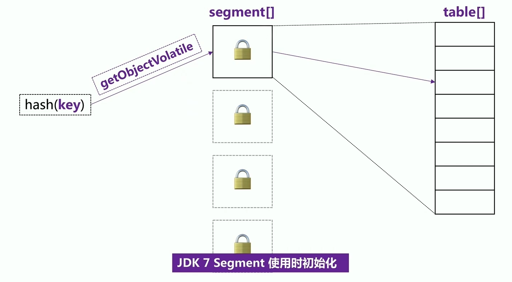
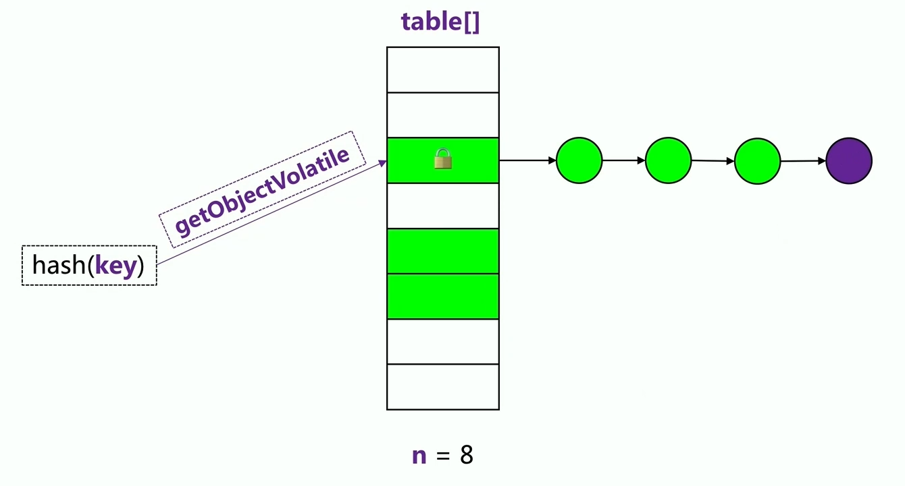

# ConcurrentHashMap

#### 原理

* JDK5：分段锁（segment 16个），必要时加锁，hash高位对应段，低位对应段中table位置

  * hash的key为数字时，在3万到四五十万之间的范围，算出来的段集中在14~15，退化成了HashTable

* JDK6：优化二次 Hash 算法，即使算出来段位置更加均匀

* JDK7：段懒加载，尽可能使用 Volatile & cas 避免加锁

  * JDK7 以前段（Segment）直接初始化，现在是懒加载的

  * 由于段懒加载，A线程访问时在初始化段A，B线程同时也在访问段A则存在可见性问题，所以 JDK7 使用了对数组的 Volatile：`Unsafe.getObjectVolatile()`

    

* JDK8：摒弃段，基于 HashMap 原理的并发实现，对于不必加锁的地方使用 Volatile 进行访问，在一些没有办法的场景如写入，对很小的一个范围进行加锁

  

#### 如何计数

* JDK 5~7 基于段元素个数求和，二次不同就加锁再次求和
* JDK8 引入 CounterCell，本质上也是分段计数

#### CHM 是弱一致性的

* 添加元素后不一定能读到
* 清空之后可能仍然会有元素
* 遍历之前的段元素变化会读到
* 遍历之后的段元素变化读不到
* 遍历元素时发生变化不抛异常

#### HashTable 的问题

* 大锁：对 HashTable 对象加锁，粗暴野蛮
* 长锁：直接对方法加锁
* 读写锁共用：只有一把锁，从头锁到尾

#### CHM 的解放

* 小锁：分段锁（5~7），桶节点锁（8）
* 短锁：先尝试获取，失败再加锁
* 分离读写锁：读失败再加锁（5~7），volatile 读 CAS写（7~8）